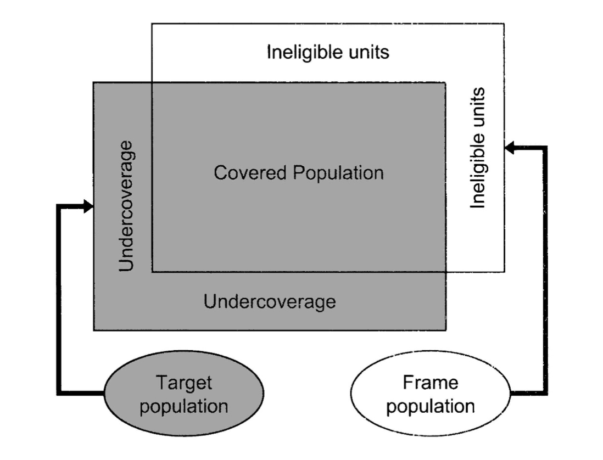
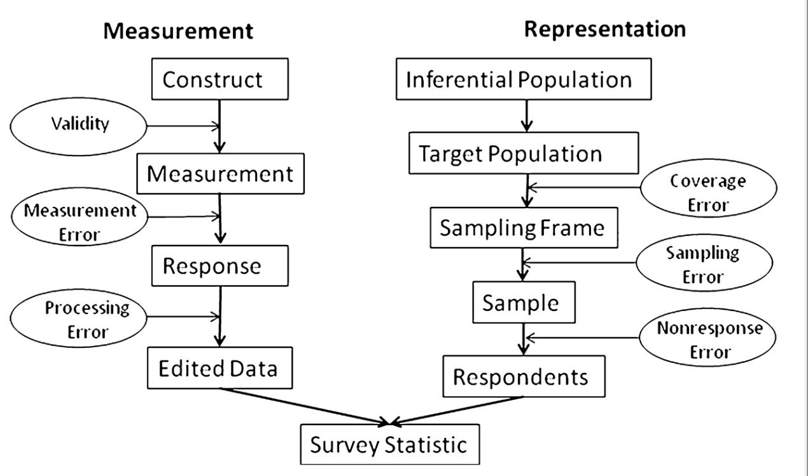

# Foundations

## What is sampling?

- Population
    - Finite population
    - Infinite population
- Sample: a subset of the population.
- Sampling: making inferences about the (finite) population without the need to measure the entire population.
- Sampling error: the error resulting from selecting a sample instead of examining the entire population.

## Why sampling?

1. To reduce the costs of data collection.
2. To obtain information faster.
3. Sometimes, to obtain more precise information about the population.
4. Sometimes, it is the only way to obtain information about the population of interest.

## How can we do sampling?

- 2 types of sampling
    - probability (random) sampling
    - NON-probability sampling
- Simply put, random sampling uses a probabilistic mechanism (rule, strategy) to obtain the sample.

## Example

Suppose our interest is to know the employment rate in Uruguay at a given point in time.

There are two ways to obtain the employment rate:

1. measure the employment status of every person in the population and then compute the mean over the population.
2. select a subset (sample) of the population and use the sample mean as an approximation (estimate) of the population employment rate.

## Example

Broadly speaking:

- the first approach is called a **CENSUS** and can provide precise information, but its cost makes it unfeasible.
- the second approach is called a **sample survey**, which reduces costs significantly, but estimates coming from the sample may be quite different from the population values.

## Example

In this example:

- the true employment rate in the population is called the **parameter**
- with the sample survey we obtain an estimate of the parameter

There are many ways or strategies to obtain a sample of the population. Finding the best sample (and its corresponding estimator) is one of the central goals of sample surveys.

## Something to keep in mind...

Since sample surveys are based solely on a sample of the population, there is always the "risk" that the sample fails to represent the population.

# A Toy Example

## Toy example

- **Population** = industrial firms in Uruguay (of size $N=4$)

| ID | \# employees ($x$) | sales ($y$) |
|:--:|:--:|:--:|
| 1 | 4  | 1  |
| 2 | 6  | 3  |
| 3 | 6  | 5  |
| 4 | 20 | 15 |

- **Parameter of interest**: average sales of the firms in the population

$$ \theta = \bar Y =\sum\limits_{i=1}^N y_i/N=(y_1+y_2+y_3+y_4)/4$$

- the values of $y$ are obtained only for the units included in the sample.

## Toy example

- Instead of observing the $N=4$ firms, we want to select a sample of size $n=2$.
- there are 6 possible samples (cases)

| case | sample ID | sample mean ($\bar y$) | sampling error |
|:--:|:--:|:--:|:--:|
| 1 | 1,2 | 2  | |
| 2 | 1,3 | 3  | |
| 3 | 1,4 | 8  | |
| 4 | 2,3 | 4  | |
| 5 | 2,4 | 9  | |
| 6 | 3,4 | 10 | |

- each sample has a sampling error
- two ways to select one of the six possible samples:
    - Non-probability sampling: select a sample subjectively
    - Probability sampling: select a sample using a probability rule

## Random sampling

- Simple random sampling (SRS or SI): assigns the same selection probability to each of the possible samples.

| case | sample ID | sample mean ($\bar y$) | sampling error | sel. prob. |
|:--:|:--:|:--:|:--:|:--:|
| 1 | 1,2 | 2  | -4 | 1/6 |
| 2 | 1,3 | 3  | -3 | 1/6 |
| 3 | 1,4 | 8  | 2  | 1/6 |
| 4 | 2,3 | 4  | -2 | 1/6 |
| 5 | 2,4 | 9  | 3  | 1/6 |
| 6 | 3,4 | 10 | 4  | 1/6 |

- the sample mean ($\bar y$) has a discrete probability distribution.

## Random sampling

- probability mass function of $\bar y$

$$
  p_{\bar y}(y)=\begin{cases}
    1/6, & \text{if } y \in \{2,3,4,8,9,10\}.\\
    0, & \text{otherwise}.
  \end{cases}
$$

- Unbiasedness
- Variance

## Important!

- We do **not** assume a model for $y_i$ in the example: a completely different approach from the traditional one!!
- Design-based approach: the reference distribution is the sampling distribution.

# Definitions and Notation

## Definitions and notation

- $U=\{1,2,\dots,i,\dots,N\}$: universe / finite population
- $N$: population size
- $s$: subset of $U$, i.e. the sample.
- $S$: the set of all possible samples (or those under consideration).
- $\hat \theta = \hat \theta (y_i; i\in s)$: a statistic
    - when a statistic is used to approximate a parameter, we call it an **estimator**.

## Definitions and notation

The probability distribution of the samples (or the sampling distribution) is a function $p(\cdot)$ defined on $S$ and satisfies:

1. $p(s)=\text{Prob}(s) \in [0,1] \ \ \forall \ s \in S$
2. $\sum\limits_{s \in S} p(s)=1$

- the function $p(\cdot)$ is called the **sampling design**.

The (induced) probability distribution of a statistic is:

1. Expectation: $E(\hat \theta)=\sum\nolimits_{s \in S} p(s)\, \hat \theta (s)$
2. Variance: $\text{Var}(\hat \theta) =\sum\nolimits_{s \in S} p(s) [\hat \theta (s)- E(\hat \theta)]^2$
3. MSE: $\text{MSE}(\hat \theta)=\sum\nolimits_{s\in S}p(s)[\hat \theta (s) -\theta]^2=\text{Var}(\hat \theta)+[E(\hat \theta)-\theta]^2$

## Random sampling

::: {.block}
::: {.block-title}
Definition
:::
For each element or individual of the population $U$, the probability that the element is included in the sample is greater than zero.
:::

::: {.block}
::: {.block-title}
Advantages
:::
- eliminates subjectivity or intentionality when selecting the sample
- removes sampling bias (also called selection bias)
:::

## Random sampling

- What is selection bias?
- ($\theta$: true value, $\hat \theta$: estimate of the value of $\theta$)

$$ \begin{split}
\text{(sampling) error of } \hat\theta  & = \hat \theta -\theta \\
 & =\{\hat \theta - E(\hat \theta) \} + \{ E(\hat \theta) -\theta \} \\
 & = \text{spread} + \text{bias}
\end{split} $$

- in non-probability sampling, the spread is zero but there is a bias.
- in probability sampling, there is spread but the bias is zero.

## Random sampling

::: {.block}
::: {.block-title}
CLT
:::
- $\hat \theta$ follows approximately a normal distribution when the sample size is large enough.
:::

- Additional advantages with (large) random samples:
    1. improves the precision of the estimator
    2. confidence intervals can be computed and hypothesis tests carried out
- with the **same** sample size, we can obtain **different** precisions.

## Important!

Inferences about the population parameters are based on the selection mechanism and have nothing to do with the values $y_i$ in the population.

- the reference distribution to compute the expectation and variance of the estimator comes from the sampling design (i.e. repeating the same thing many times)
- we do not assume (model) anything about the values $y_i$ (unlike traditional statistics) and treat them as fixed.

Let us see it with the (toy) example.

## Toy example 2

- random sampling with unequal probabilities

| sample ID | values $y_i$ | estimator of $\bar Y$ | sel. prob. |
|:--:|:--:|:--:|:--:|
| 1,4 | 1, 15 | 4.5 | 1/3 |
| 2,4 | 3, 15 | 6   | 1/3 |
| 3,4 | 5, 15 | 7.5 | 1/3 |

- What is the probability distribution of the mean estimator?
- What is the expected value of the estimator?
- Compute the variance and compare it to SRS (SI).

# Survey Process

## Stages of a survey

1. Define the **population or universe**: the population we want to investigate and draw conclusions about.
2. Determine the characteristics of interest of the population (e.g. total sales, average income, employment rate, proportion of poor people, etc.).
3. Find (or create) the sampling frame: any instrument that lets us associate the elements of the population we are going to sample (e.g. INE census, phone directory, student registry, etc.).
4. Obtain a sample using a random sampling design.
5. Measure the study variables.
6. Use the obtained values to produce point estimates and compute standard errors.

## Procedures in sample surveys

1. Planning
    - define the objectives
    - select the sampling frame
2. Design and development
    - sampling design
    - questionnaire design
3. Implementation
    - data collection
    - capture and coding methods
    - editing and imputation
    - estimation
    - data analysis
    - data dissemination
4. Evaluation and documentation

## Two aspects of survey design

1. Sampling design: how to collect the sample?
    - what is the target population?
    - what is the sampling frame?
    - what information is available in the sampling frame?
    - what is the cost of observing each of the sample units?
2. Instrument design: how to obtain measurements from the selected units?
    - what are the research questions?
    - what variables do we want to measure in the sample?
    - how should we phrase the questions correctly?
    - are there other variables we want to measure for the weighting stage?

# Sources of Error

## Sources of error

::: {.block}
::: {.block-title}
Non-observation error
:::
- Coverage error
    - population $\neq$ sampling frame
    - some individuals are not "listed"
- Sampling error
    - frame $\neq$ sample
    - some listed individuals are not sampled
    - some sampled individuals do NOT respond (i.e. effective sample $\neq$ theoretical sample)
:::

::: {.block}
::: {.block-title}
Observation error
:::
- measurement errors: interviewer, respondent, instrument, mode, etc.
- data processing error
:::

## Coverage errors

{width="65%" fig-align="center"}

## Total survey error

{width="80%" fig-align="center"}

## Errors

- **sampling error**:
    - if $n=N$, there is no sampling error.
    - moreover, if $n \uparrow$ then the sampling error $\downarrow$
- **non-sampling errors:** everything else!
    - even if $n=N$ there are non-sampling errors.
    - in practice, we can "reduce" non-sampling errors by reducing $n$.
- Because of non-sampling error, a sample is usually more precise than a census.

## Summing up

- the course focuses on the sampling error of $\hat \theta$
    1. what is it?
    2. how can we reduce it?
    3. how do we measure it?
    4. and other things...
