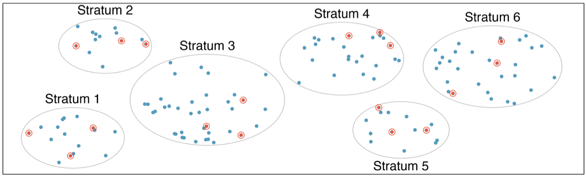

# Stratified Sampling

## Stratified sampling

1. the population $U$ is stratified into $H$ mutually exclusive and exhaustive subpopulations, called **strata**:
$$ U= U_1\cup\dots U_h\cup\dots\cup U_H$$
where $U_h \cap U_g=\varnothing$ for $h\neq g$.
2. Within each stratum, an independent random sample is selected under any sampling design:
$$\pi_{ij}=\text{Prob}[i\in s_h]\times\text{Prob}[j\in s_g] \ \ \forall\, h\neq g$$

## Example — stratified sampling

The population is grouped/separated into strata ($H=6$).

Within each stratum an independent sample $s_h$ of size $n_h$ is selected under any sampling design.

{width="65%" fig-align="center"}

## Stratification

Stratification variables in household and individual surveys:

- regional (departments, cities, etc.)
- demographic variables (sex, age group)
- socioeconomic (educational level, income bracket, etc.)

## Stratification

Stratification variables in business surveys:

- firm size (number of employees, sales volume, etc.)
- economic activity of the firm (industry, retail, etc.)

**Important:** the $\mathbf{x}$ variables must be contained in the sampling frame ($F$).

## Why stratify?

- **protect ourselves** from the possibility of getting a really bad sample
- define **specific precisions** for different subpopulations (domains)
- obtain **more precise estimates** for the population total
- define **different weights** (sampling rates by stratum)

## Estimation

The HT estimator for $Y=\sum\nolimits_{h=1}^H Y_h$, where $Y_h=\sum\nolimits_{i\in U_h}y_{hi}$:

1. **HT estimator**
$$\hat Y_{\text{HT}}=\sum\limits_{h=1}^H \hat Y_{\text{HT},h}$$
where $\hat Y_{\text{HT},h}$ is unbiased for $Y_h$.
2. **Variance**
$$V(\hat Y_{\text{HT}})=\sum\limits_{h=1}^H V(\hat Y_{\text{HT},h}) $$
by independence.
3. **Variance estimation**
$$\hat V(\hat Y_{\text{HT}})=\sum\limits_{h=1}^H \hat V(\hat Y_{\text{HT},h}) $$
where $\hat V(\hat Y_{\text{HT},h})$ is unbiased for $V(\hat Y_{\text{HT},h})$.

# Simple Stratified Sampling

## Simple stratified sampling

Within each stratum we select a random sample under a simple design (SRS):

- $N_h=$ size of stratum $h$
- $n_h=$ sample size in stratum $h$
- $\bar y_h=$ sample mean in stratum $h$
- $\text{var}_{U_h}[y]=$ population variance in stratum $h$
- $\pi_{hi}=n_h/N_h=$ selection probability of individual $i$ in stratum $h$
- $w_{hi}=N_h/n_h=$ original weight of individual $i$ belonging to stratum $h$

## Simple stratified sampling

1. **HT estimator**
$$\hat Y_{\text{HT}}=\sum\limits_{h=1}^H N_h\bar y_h$$
where $\bar y_h=\sum\nolimits_{i\in s_h}y_{hi}/n_h$.
2. **Variance**
$$V(\hat Y_{\text{HT}})=\sum\limits_{h=1}^H N_h^2(1-n_h/N_h)\frac{\text{var}_{U_h}[y]}{n_h} $$
where $\text{var}_{U_h}[y]=(N_h-1)^{-1}\sum\nolimits_{i\in U_h}(y_{hi}-\bar Y_h)^2$.
3. **Variance estimation**
$$\hat V(\hat Y_{\text{HT}})=\sum\limits_{h=1}^H N_h^2(1-n_h/N_h)\frac{\text{var}_{s_h}[y]}{n_h} $$
where $\text{var}_{s_h}[y]=(n_h-1)^{-1}\sum\nolimits_{i\in s_h}(y_{hi}-\bar y_h)^2$.

## Example — simple stratified sampling

| $h$ | sector | $N_h$ | $n_h$ | $w_{hi}$ |
|:--:|:--|--:|--:|--:|
| 1 | Industry | 600 | 50 | 12 |
| 2 | Retail trade | 1200 | 50 | 24 |
| 3 | Wholesale trade | 400 | 50 | 8 |
| 4 | Services | 2300 | 50 | 46 |
| 5 | Health | 500 | 50 | 10 |
| Total | | 5000 | 250 | |

# Sample Allocation

## Allocating the sample size by stratum

One of the most important problems in stratified sampling is, given a sample size $n$, deciding the sample size $n_h$ in each stratum.

This situation is called the **problem of sample size allocation by stratum**.

Sample allocation: given $n=\sum_{h=1}^H n_h$, how do we choose $n_h$?

## Different strategies

There are several ways to allocate the sample size by stratum:

- **proportional** allocation
- **optimal** allocation
- uniform allocation
- allocation proportional to size based on $x$
- allocation to achieve similar $moe$ across strata

## Proportional allocation

The sample size in the stratum is proportional to the size of the stratum in the population:

$$n_h=n\times \frac{N_h}{N}=n\times W_h$$

- under proportional allocation, the weights $w_{hi}\approx N/n$ are approximately equal.
- the variance of the HT estimator is:
$$V_{prop}(\hat Y_{\text{HT}})=\frac{N^2}{n}(1-n/N)\sum\limits_{h=1}^H W_h\,\text{var}_{U_h}[y]$$

## Proportional allocation

Assuming that $N_h$ is large enough, we have:

$$
\begin{aligned}
    \sum\limits_{h=1}^H \frac{N_h}{N}\text{var}_{U_h}[y] &=\frac{1}{N}\sum\limits_{h=1}^H \frac{N_h}{N_h-1}\sum\limits_{i=1}^{N_h} (y_{hi}-\bar Y_h)^2\\
     &\approx \frac{1}{N-1}\sum\limits_{h=1}^H \sum\limits_{i=1}^{N_h}(y_{hi}-\bar Y_h)^2\\
     & \leq \frac{1}{N-1}\sum\limits_{h=1}^H \sum\limits_{i=1}^{N_h}(y_{hi}-\bar Y)^2=\text{var}_{U}[y]
\end{aligned}
$$

Then,

$$V_{prop}(\hat Y_{\text{HT}})\leq  V_{SRS}(\hat Y_{\text{HT}})$$

## Optimal allocation

**Two distinct problems**

1. sample allocation: given a sample size $n$, how should we allocate (split) the sample sizes $n_1,\dots,n_h,\dots,n_H$?
2. sample size determination: what should we use to determine $n=\sum\nolimits_{h=1}^H n_h$?

**Two distinct scenarios:**

1. Budget: given a budget, we want to find the best strategy to determine the sample size $n$ and its allocation across strata.
2. Margin of error: given a $moe$ for the estimate, we want to find the best strategy for sample size determination.

## Scenario 1

- given a budget $C$, we want to find the best way to allocate the sample so as to minimize
$$V_{STSI}(\hat Y_{\text{HT}}) $$
subject to the constraint that the total cost is $\leq C$.
- Mathematically, this is an optimization problem.

## Optimal allocation

::: {.block}
::: {.block-title}
Total cost
:::
1. $c_0$: fixed/initial cost (e.g. building the questionnaire)
2. $c_h$: cost per observation (e.g. interview) in stratum $h$
3. $n_h$: sample size in stratum $h$
:::

It is reasonable to assume that the total cost of the study is:

$$C = c_0+\sum\limits_{h=1}^H n_hc_h$$

## Neyman (= optimal) allocation

- we want to find $n_1,\dots,n_h,\dots,n_H$ that minimize:
$$V_{STSI}(\hat Y_{\text{HT}})=\sum\limits_{h=1}^H \frac{N_h}{n_h}\text{var}_{U_h}[y] -\sum\limits_{h=1}^H N_h\,\text{var}_{U_h}[y]$$
subject to
$$c_0+\sum\limits_{h=1}^H n_hc_h$$
- the solution to the above optimization problem is:
$$n_h \propto \frac{N_h\,\text{sd}_{U_h}[y]}{\sqrt{c_h}}$$

## Optimal allocation

- given a sample size $n$, the optimal allocation is:
$$n_h=n\times \frac{N_h\,\text{sd}_{U_h}[y]/\sqrt{c_h}}{\sum\nolimits_{h=1}^HN_h\,\text{sd}_{U_h}[y]/\sqrt{c_h}} $$
- **interpretation:**
    - if $N_h \uparrow$ then $n_h \uparrow$
    - if $\text{sd}_{U_h}[y] \uparrow$ then $n_h \uparrow$
    - if $c_h \uparrow$ then $n_h \downarrow$
- If $c_h$ is equal, the optimal allocation is:
$$n_h=n\times \frac{N_h\,\text{sd}_{U_h}[y]}{\sum\limits_{h=1}^H N_h\,\text{sd}_{U_h}[y]}$$
- **remark:** if the $\text{sd}_{U_h}[y]$ are all equal, the optimal allocation reduces to proportional allocation.

## Optimal allocation

- if the per-unit costs $c_h$ are equal, then:
$$V_{opt}(\hat Y_{\text{HT}})= \frac{N^2}{n}\left(\sum\nolimits_{h=1}^H W_h\,\text{sd}_{U_h}[y]\right)^2 - N\sum\nolimits_{h=1}^HW_h\,\text{var}_{U_h}[y] $$
- note that, under proportional allocation, we have:
$$V_{prop}(\hat Y_{\text{HT}})=\frac{N^2}{n}\left(\sum\nolimits_{h=1}^H W_h\,\text{var}_{U_h}[y]\right) - N\sum\nolimits_{h=1}^HW_h\,\text{var}_{U_h}[y]$$
- comparing the two variances, we can show that:
$$ V_{opt}(\hat Y_{\text{HT}}) \leq V_{prop}(\hat Y_{\text{HT}})$$

# Sample Size Determination

## Sample size determination under SRS

- the sample size $n$ to obtain a $moe$ at the $(1-\alpha/2)\%$ level under SRS is:
- for estimating the **mean** $\bar Y=N^{-1}\sum_{i\in U}y_i$:
$$n=\frac{(z_{1-\alpha/2})^2\,\text{var}_{U}[y]}{moe^2+(z_{1-\alpha/2})^2\,\text{var}_{U}[y]/N}$$
- for estimating a **total** $Y=\sum_{i\in U}y_i$:
$$n=N^2\frac{(z_{1-\alpha/2})^2\,\text{var}_{U}[y]}{moe^2+(z_{1-\alpha/2})^2\,\text{var}_{U}[y]N}$$

## Under STSI with proportional allocation

- recall that, under proportional allocation, we have:
$$V_{prop}(\hat Y_{\text{HT}})=\frac{N^2}{n}(1-n/N)\,\text{var}_U[w]$$
where $\text{var}_U[w]=\sum\limits_{h=1}^H W_h\,\text{var}_{U_h}[y]$
- therefore, we can substitute $\text{var}_U[w]$ for $\text{var}_{U}[y]$ in the SRS formulas.

## Under STSI with proportional allocation

- for estimating the **mean** $\bar Y=N^{-1}\sum_{i\in U}y_i$:
$$n=\frac{(z_{1-\alpha/2})^2\,\text{var}_{U}[w]}{moe^2+(z_{1-\alpha/2})^2\,\text{var}_{U}[w]/N}$$
- for estimating a **total** $Y=\sum_{i\in U}y_i$:
$$n=N^2\frac{(z_{1-\alpha/2})^2\,\text{var}_{U}[w]}{moe^2+(z_{1-\alpha/2})^2\,\text{var}_{U}[w]N}$$
- once $n$ is determined, the sizes $n_h$ in each stratum are easily determined.

## Under STSI with optimal allocation

- under optimal allocation (with equal costs), we have:
$$n_h=n\times \frac{N_h\,\text{sd}_{U_h}[y]}{\sum\nolimits_{h=1}^HN_h\,\text{sd}_{U_h}[y]} $$
- in this case, the variance for the mean estimator is:
$$V_{opt}(\hat{\bar Y}_{\text{HT}})=\frac{1}{n}\left(\sum_{h=1}^HW_h\,\text{sd}_{U_h}[y]\right)^2 -\frac{1}{N}\text{var}_U[w] $$

## Under STSI with optimal allocation

- then, we can solve for $n$, for estimating the mean:
$$moe=z_{1-\alpha/2}\sqrt{\frac{1}{n}\left(\sum_{h=1}^HW_h\,\text{sd}_{U_h}[y]\right)^2 -\frac{1}{N}\text{var}_U[w]} $$
- if we ignore the second term $\frac{1}{N}\text{var}_U[w]$, the solution is:
$$n\approx \frac{z_{1-\alpha/2}^2\left(\sum_{h=1}^HW_h\,\text{sd}_{U_h}[y]\right)^2}{moe^2} $$
